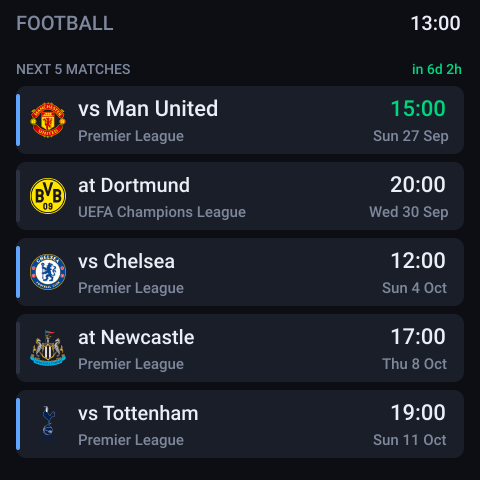
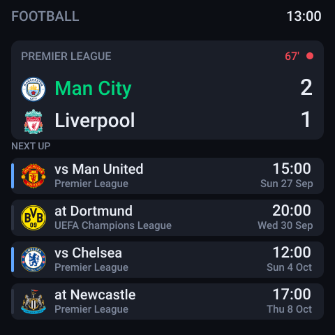
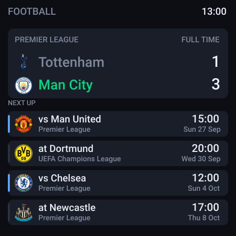

# Presto Football Dashboard

A football dashboard for the [Pimoroni Presto](https://shop.pimoroni.com/products/presto).
Shows your club's next five matches across every competition they play in,
switches to a live score at kick off, and holds the final score for 24 hours
afterwards.

<p align="center">
  
  
  
</p>

Left to right: upcoming fixtures, a match in progress, and a final score being
held. Times are shown in your own timezone.

## What it does

- **Next five matches** - day, date and kick off time in your timezone, with
  the competition and a home/away marker.
- **Live scores** - when a match kicks off the top of the screen becomes a
  score panel with the elapsed minute; half time shows as `HALF TIME`.
- **Final score held for 24 hours** - after the whistle the result stays put,
  with the next four fixtures listed beneath it.
- **Club crests**, downloaded and shrunk on the device.
- **Ambient LEDs** that follow the football - see below.
- **Several teams at once** - follow as many as you like; their fixtures are
  merged and sorted.

Everything is drawn locally between updates, so the clock and countdown keep
ticking without touching the network.

## Hardware

- A Pimoroni Presto, running the [official MicroPython firmware](https://github.com/pimoroni/presto/releases)
  (developed against 1.29.0).
- A 2.4GHz WiFi network.
- On your computer: [uv](https://docs.astral.sh/uv/getting-started/installation/)
  for the flashing and test tooling. The code on the board has no dependencies
  beyond the firmware itself.

## Setup

**1. Get a free API token** from
[football-data.org/client/register](https://www.football-data.org/client/register).
It arrives by email in a minute or two.

**2. Create your `secrets.py`:**

```bash
cp secrets.example.py secrets.py
```

Then fill it in:

```python
WIFI_SSID = "your_ssid"
WIFI_PASSWORD = "your_password"

FOOTBALL_DATA_TOKEN = "your-token"

FAVOURITE_TEAMS = ["Manchester City FC"]

UTC_OFFSET = 5.5        # hours ahead of UTC
USE_24_HOUR = True
```

`secrets.py` is gitignored - it never gets committed.

**3. Copy it to the board.** The host-side tooling is managed with
[uv](https://docs.astral.sh/uv/):

```bash
uv sync        # creates .venv with mpremote, pillow and ruff
./deploy.sh
```

`deploy.sh` uses the project's uv environment when uv is available, and falls
back to a plain `python3 -m mpremote` otherwise (`pip install mpremote`).

Or copy the files yourself with Thonny: `main.py`, `football_scores.py`,
`football_badges.py`, `secrets.py` and `Roboto-Medium.af`, all to the root of
the board.

The dashboard starts on boot. The first run spends about half a minute
fetching crests - until each one arrives the team's initials are drawn in its
place.

## Configuration

All of it lives in `secrets.py`:

| Setting | Meaning |
| --- | --- |
| `FOOTBALL_DATA_TOKEN` | Your free API token. |
| `FAVOURITE_TEAMS` | Teams to follow. Numeric football-data ids, or names. |
| `UTC_OFFSET` | Hours ahead of UTC, e.g. `5.5`, `-5`, `1`. |
| `USE_24_HOUR` | `False` for am/pm kick off times. |
| `LEDS_ENABLED` | `False` to leave the ambient LEDs alone. |
| `LED_BRIGHTNESS` | `0.0` to `1.0`, default `1.0`. |

**Team names are matched loosely** - `"Manchester City"`, `"Manchester City FC"`,
`"Man City"` and `"MCI"` all find the same club, and accents are ignored so
`"Atletico Madrid"` matches `"Atlético Madrid"`.

A name costs one or two extra API calls at every boot while it is looked up.
If you would rather skip that, use the numeric id - you can find it in the
competition listings, for example
`https://api.football-data.org/v4/competitions/PL/teams`.

Tuning knobs live at the top of `football_scores.py`: `SCHEDULE_REFRESH_S`,
`MIN_LIVE_INTERVAL_S`, `BADGE_SIZE`, `RESULT_HOLD_S`, `LED_IDLE_CYCLE_S`,
`LED_FADE_S` and friends.

## The LEDs

Presto has seven LEDs around the edge of the screen, and the dashboard drives
them from the colours in the club crests:

| When | What the LEDs do |
| --- | --- |
| A match is on | Home side's colour down the left, away side's down the right, blended across the top |
| After a match | The winner's colour all the way round, for as long as the result is held. A draw keeps the two-sided split |
| No football on | The favourite clubs' colours, one every fifteen minutes |

Every change fades down to black, swaps, and fades back up.

The colours are sampled from each crest while it is being decoded for the
screen, so nothing extra is downloaded. A crest is mostly outline and white
space, so the commonest colour is rarely the interesting one - neighbouring
shades are clustered together and then weighted by saturation, which pushes
the club's actual colours to the front:

| Club | Colours found |
| --- | --- |
| Manchester City | navy, sky blue, gold |
| Borussia Dortmund | yellow, black |
| AC Milan | black, red |
| Real Madrid | gold, blue, red |

It follows the crest rather than what a fan would name, so the odd club comes
out unexpectedly. Liverpool leads with the teal from its crest, which really
does cover slightly more of the artwork than the red does; the red is next in
the cycle.

Turn the whole thing off with `LEDS_ENABLED = False`, or tone it down with
`LED_BRIGHTNESS` (0.0 to 1.0).

## Which competitions are covered

football-data.org's free tier covers the current season for twelve
competitions: the Premier League, La Liga, Serie A, Bundesliga, Ligue 1,
Eredivisie, Primeira Liga, Championship, Brazilian Série A, the Champions
League, the Euros and the World Cup.

Domestic cups (the FA Cup, EFL Cup and their equivalents) are generally not
included, so those ties will be missing from the fixture list. In practice the
team endpoint has been seen to return some continental cups beyond the
documented twelve, so you may get more than the list promises.

## How it uses the API

The free tier allows **10 requests per minute**, with no daily cap, so the job
is spacing calls out rather than rationing them.

- **Fixtures** are refreshed every six hours - one call per team. That same
  call also carries recently finished matches, so holding a final score on
  screen costs nothing extra.
- **Live scores** poll only the teams actually playing, at most once a minute
  each. Nothing is fetched when no match is on.
- `api_get` refuses to fire if ten calls have already gone out in the last
  minute, so the limit cannot be tripped even if something loops.
- A failed refresh backs off for ten minutes instead of retrying hard.

**Crests do not count against the limit.** They come from a token-free CDN.

A typical day costs a handful of calls; a match day a few dozen.

## Notes from building this

Four things about the Presto that cost real time to work out, in case they
save you some:

**Never write to flash while the display is running.** Presto renders from a
loop on core 1, and a flash write has to lock that core out while XIP is
halted. The driver's own handler describes the wait as `not tight but endless
potentially`, and in practice it deadlocks the board - screen frozen, USB
unresponsive, recoverable only by unplugging it. This dashboard keeps
everything in RAM and re-derives it at startup. Pimoroni's own launcher
sidesteps the same problem by putting its scratch files on a PSRAM ramfs.

**Do not `print()` from an app that runs on boot.** If a host has the USB
serial port open but is not reading it, the transmit buffer fills and `print()`
blocks forever - which looks exactly like a hung board. `DEBUG` is off by
default for this reason; turn it on only while watching over a serial link.

**`pngdec` can only scale images up.** Crests arrive at 200×200 and the
dashboard wants them at 36px, so `football_badges.py` decodes each PNG in
Python, box-filters it down, flattens it over the panel colour and re-encodes
a small PNG held in memory. `pngdec.open_RAM()` then draws it. Conversion
takes a few seconds per crest, once.

**The bundled font is ASCII only.** `Roboto-Medium.af` carries the 95
printable ASCII glyphs and nothing else, so accented club names would draw
with gaps. Names are folded to ASCII before drawing: `Série` → `Serie`,
`Beşiktaş` → `Besiktas`.

`main.py` also waits eight seconds before starting the dashboard. Once the app
owns the display and the network, getting a REPL back can otherwise mean
power-cycling the board; the pause guarantees a window. Drop a file called
`noboot` on the filesystem during it and the dashboard will not start.

## Troubleshooting

**The screen shows an amber message.** That is the status line. `Fixtures: ...`
means the API call failed - check the token and the team name.

**A team is not found.** Its competition may be outside the free tier, or the
name may not match. Use the numeric id instead.

**Kick off times are an hour out.** `UTC_OFFSET` does not follow daylight
saving, because football-data.org reports UTC only. Adjust it when your clocks
change.

**The board is unresponsive.** Unplug and replug it, then run `./deploy.sh`,
which grabs the board during the eight second boot pause. If the dashboard
crashed at startup, the traceback is in `/boot_error.txt` on the board.

**Badges never appear.** They are fetched one per pass of the main loop and
take a few seconds each. Initials are drawn until then. If one consistently
fails it is skipped and the initials stay.

## Tests

The logic runs on desktop CPython with the hardware stubbed out:

```bash
uv run run_tests.py
```

That fetches the crest corpus on first run and executes all four suites. To
run one on its own:

```bash
uv run tests/test_logic.py         # date maths, pacing, accent folding
uv run tests/test_api.py           # API client and match lifecycle
uv run tests/test_badges.py        # PNG decoder, checked against Pillow
uv run tests/test_layout.py        # screen geometry for every state
```

Linting uses the same rule set as Pimoroni's CI, configured in
`pyproject.toml`:

```bash
uv run ruff check .
```

`tests/preview.py` renders each screen state to `layout.html`, which is how
the images at the top of this README were produced - useful for iterating on
the layout without touching hardware.

## Layout

```
football_scores.py    the dashboard: API client, pacing, layout, main loop
football_badges.py    PNG decode / downscale / re-encode, in-memory crest cache
main.py               boot wrapper: grace window, crash log
secrets.example.py    template for your settings
Roboto-Medium.af      the font, from Pimoroni's Presto examples

deploy.sh             copy everything to the board and restart it
run_tests.py          run the whole desktop suite
pyproject.toml        uv project: dev tooling and lint configuration
tests/                desktop tests, hardware stubbed out
```

## Licence

MIT - see [LICENSE](LICENSE).

`Roboto-Medium.af` comes from [Pimoroni's Presto examples](https://github.com/pimoroni/presto)
(MIT); Roboto itself is Apache 2.0. See [docs/FONT-LICENSE.txt](docs/FONT-LICENSE.txt).

Match data from [football-data.org](https://www.football-data.org/). Crests are
served by football-data.org and remain the property of their respective clubs.
